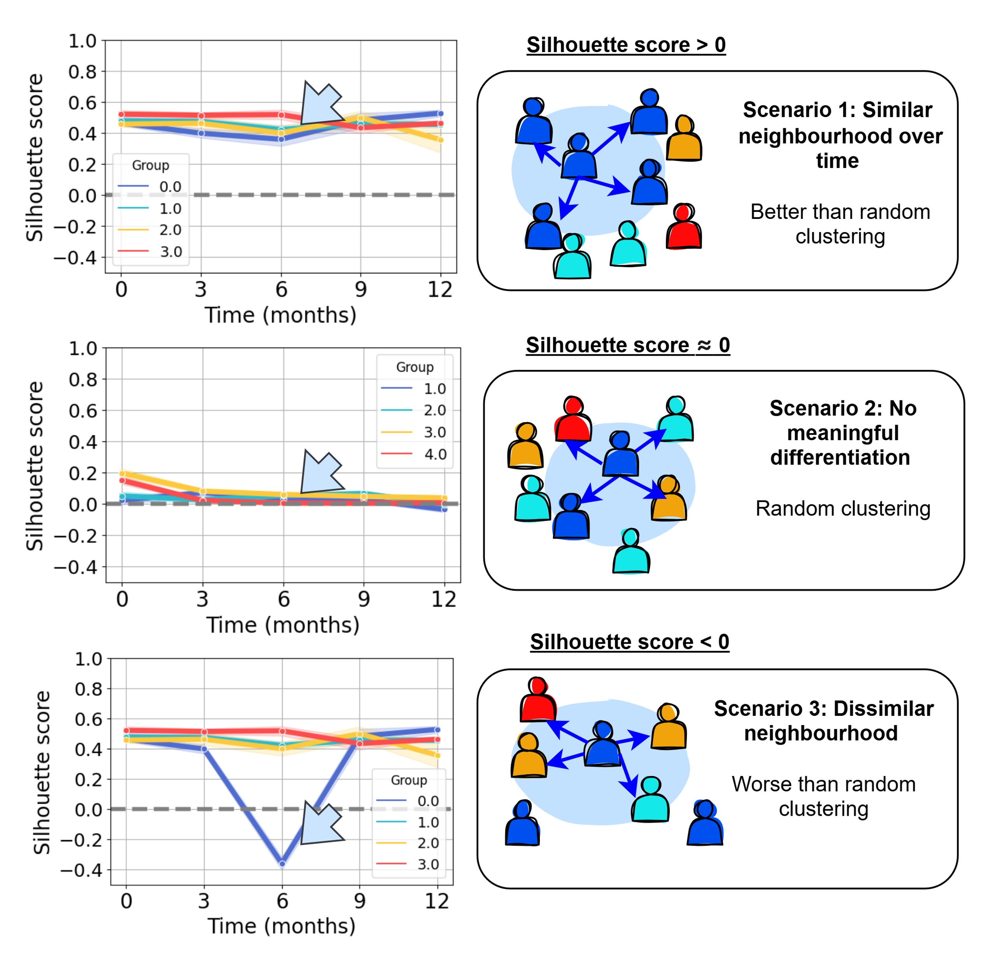

# Temporal analysis subsets

Targeted treatment aims to make patients more similar to each, reducing the ability to identify subsets. Here you find a Python script to assess temporal stability in such situations (where the exact characteristics that define subsets, may dissolve as a conseuqence of treatmetn) - to see if patients with similar baseline features still end up in the same 'neighbourhoods'. 

In our case, we used this to evaluate whetehr patietns with similar baseline joint involvement patterns in Rheumatoid Arthritis, consistently cluster more closely with their baseline "neighbours" who have similar joint involvement patterns at baseline (k=50 nearest neighbors across different clinical signatures (i.e. patient embedding)).

## Methodology 
Our temporal analysis function works as follows"

On baseline:
-	Step 1: Run k-nearest neighbors (k = 50) to identify each patient’s baseline neighbors (according to cosine distance)

Then for each visit: 
-	Step 2: Compute the within-neighborhood distance and the between-neighborhood distance, and calculate the silhouette score (SS)
-	Step 3: Check for every patient if we maintain a smaller ‘within’ distance with baseline neighbours compared to all other patients (SS > 0 = good, SS < 0 = bad)
  
Finally we visualize this in a line graph (where you stratify for your labels of interest). See illustration below as aid for interpretation: 

## Visualizing & Interpreting Results

